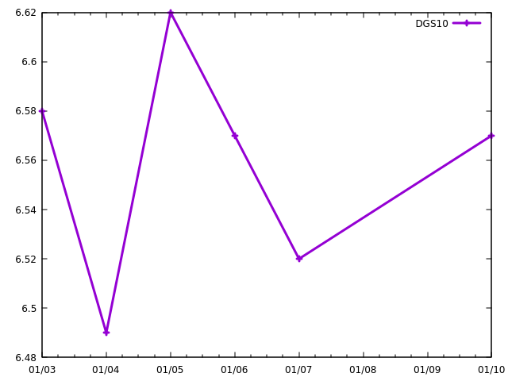

# Gnuplot from J

Although a number of plotting options are available in J and they are well documented in its wiki
I will pursue calling gnuplot from J. The reason behind this is that I want to have every
option available in gnuplot, and because I work with many languages I prefer to reuse my knowledge of
gnuplot rather than rely on, very often not so sophisticated, many graphical solutions.

Let's say we have the following CSV, toplot.csv:
```
$ cat toplot.csv
date,quote,symbol
2000-01-03,6.58,DGS10
2000-01-04,6.49,DGS10
2000-01-05,6.62,DGS10
2000-01-06,6.57,DGS10
2000-01-07,6.52,DGS10
2000-01-10,6.57,DGS10
```
We can use the heredocs feature introduced in gnuplot 5 which allows embedding the data in the same file as
plot's setting and driver. Example, below
```
$ cat toplot.gp
$d << EOD
date,quote,symbol
2000-01-03,6.58,DGS10
2000-01-04,6.49,DGS10
2000-01-05,6.62,DGS10
2000-01-06,6.57,DGS10
2000-01-07,6.52,DGS10
2000-01-10,6.57,DGS10
EOD
set datafile separator comma
set xdata time
set timefmt "%y-%m-%d"
set format x "%m/%d"
plot $d skip 1 u (timecolumn(1,"%Y-%m-%d")):2 w lp lw 3 title "DGS10"
```
In order to invoke the above script the following command can be used.
As a result, the gnuplot script will be invoked (of course gnuplot is required to be installed)
in a persistent mode in a separate window, one can look at the plot and optionally save it.
```
$ gnuplot -p -c toplot.gp
```
One should see the below figure


My way of visual interaction from J will be creating gnuplot file, like toplot.gp, and invoke it.
Afterwards, change the settings, data, and invoke again until I get the desired result.
At some point I will optionally save the figure and corresponding *.gp script if it
is worth documenting.
This is what is needed to accomplish that in a very straightforward way.
```j
   NB. we have table
   ]t
┌──────────┬─────┬──────┐
│date      │quote│symbol│
├──────────┼─────┼──────┤
│2000-01-03│6.58 │DGS10 │
│2000-01-04│6.49 │DGS10 │
│2000-01-05│6.62 │DGS10 │
│2000-01-06│6.57 │DGS10 │
│2000-01-07│6.52 │DGS10 │
│2000-01-10│6.57 │DGS10 │
└──────────┴─────┴──────┘

   NB. we can transform it to grid form (see j/analysis.ijs)
   ]g=: toGridFromTable t
┌──────────┬─────┬──────┐
│date      │quote│symbol│
├──────────┼─────┼──────┤
│2000-01-03│6.58 │DGS10 │
├──────────┼─────┼──────┤
│2000-01-04│6.49 │DGS10 │
├──────────┼─────┼──────┤
│2000-01-05│6.62 │DGS10 │
├──────────┼─────┼──────┤
│2000-01-06│6.57 │DGS10 │
├──────────┼─────┼──────┤
│2000-01-07│6.52 │DGS10 │
├──────────┼─────┼──────┤
│2000-01-10│6.57 │DGS10 │
└──────────┴─────┴──────┘

   NB. we can invoke any linux command in J
   NB. here creating file temp.gp with one line
   2!:0 'echo ''$d << EOD'' > temp.gp'

   NB. now we can append the grid
   g appenddsv 'temp.gp';',';''
150

   NB. appending lines
   2!:0 'echo ''EOD'' >> temp.gp'

   2!:0 'echo ''set datafile separator comma'' >> temp.gp'

   2!:0 'echo ''set xdata time'' >> temp.gp'

   2!:0 'echo ''set timefmt "%y-%m-%d"'' >> temp.gp'

   2!:0 'echo ''set format x "%m/%d"'' >> temp.gp'

   2!:0 'echo ''plot $d skip 1 u (timecolumn(1,"%Y-%m-%d")):2 w lp lw 3 title "DGS10"'' >> temp.gp'
```

After that we have toplot.gp file recreated
```
$ cat temp.gp
$d << EOD
date,quote,symbol
2000-01-03,6.58,DGS10
2000-01-04,6.49,DGS10
2000-01-05,6.62,DGS10
2000-01-06,6.57,DGS10
2000-01-07,6.52,DGS10
2000-01-10,6.57,DGS10
EOD
set datafile separator comma
set xdata time
set timefmt "%y-%m-%d"
set format x "%m/%d"
plot $d skip 1 u (timecolumn(1,"%Y-%m-%d")):2 w lp lw 3 title "DGS10"
```

We can now invoke it
```j
  2!:0 'gnuplot -p -c temp.gp'
  NB. gnuplot is spawn and we see the same figure
```

Alternatively we can use functionality from j/analysis.ijs
```j
   ]cmds=:'set datafile separator comma';'set xdata time;set timefmt "%y-%m-%d"';'set format x "%m/%d"';'plot $d skip 1 u (timecolumn(1,"%Y-%m-%d")):2 w lp lw 3 title "DGS10"'
┌────────────────────────────┬─────────────────────────────────────┬────────────────────┬─────────────────────────────────────────────────────────────────────┐
│set datafile separator comma│set xdata time;set timefmt "%y-%m-%d"│set format x "%m/%d"│plot $d skip 1 u (timecolumn(1,"%Y-%m-%d")):2 w lp lw 3 title "DGS10"│
└────────────────────────────┴─────────────────────────────────────┴────────────────────┴─────────────────────────────────────────────────────────────────────┘
   ]toplot=:(<cmds),<g
┌───────────────────────────────────────────────────────────────────────────────────────────────────────────────────────────────────────────────────────────────┬─────────────────────────┐
│┌────────────────────────────┬─────────────────────────────────────┬────────────────────┬─────────────────────────────────────────────────────────────────────┐│┌──────────┬─────┬──────┐│
││set datafile separator comma│set xdata time;set timefmt "%y-%m-%d"│set format x "%m/%d"│plot $d skip 1 u (timecolumn(1,"%Y-%m-%d")):2 w lp lw 3 title "DGS10"│││date      │quote│symbol││
│└────────────────────────────┴─────────────────────────────────────┴────────────────────┴─────────────────────────────────────────────────────────────────────┘│├──────────┼─────┼──────┤│
│                                                                                                                                                               ││2000-01-03│6.58 │DGS10 ││
│                                                                                                                                                               │├──────────┼─────┼──────┤│
│                                                                                                                                                               ││2000-01-04│6.49 │DGS10 ││
│                                                                                                                                                               │├──────────┼─────┼──────┤│
│                                                                                                                                                               ││2000-01-05│6.62 │DGS10 ││
│                                                                                                                                                               │├──────────┼─────┼──────┤│
│                                                                                                                                                               ││2000-01-06│6.57 │DGS10 ││
│                                                                                                                                                               │├──────────┼─────┼──────┤│
│                                                                                                                                                               ││2000-01-07│6.52 │DGS10 ││
│                                                                                                                                                               │├──────────┼─────┼──────┤│
│                                                                                                                                                               ││2000-01-10│6.57 │DGS10 ││
│                                                                                                                                                               │└──────────┴─────┴──────┘│
└───────────────────────────────────────────────────────────────────────────────────────────────────────────────────────────────────────────────────────────────┴─────────────────────────┘
   fromGridToGnuplot toplot

   NB. Or alteratively using table
   ]toplot=:(<cmds),<t
┌───────────────────────────────────────────────────────────────────────────────────────────────────────────────────────────────────────────────────────────────┬─────────────────────────┐
│┌────────────────────────────┬─────────────────────────────────────┬────────────────────┬─────────────────────────────────────────────────────────────────────┐│┌──────────┬─────┬──────┐│
││set datafile separator comma│set xdata time;set timefmt "%y-%m-%d"│set format x "%m/%d"│plot $d skip 1 u (timecolumn(1,"%Y-%m-%d")):2 w lp lw 3 title "DGS10"│││date      │quote│symbol││
│└────────────────────────────┴─────────────────────────────────────┴────────────────────┴─────────────────────────────────────────────────────────────────────┘│├──────────┼─────┼──────┤│
│                                                                                                                                                               ││2000-01-03│6.58 │DGS10 ││
│                                                                                                                                                               ││2000-01-04│6.49 │DGS10 ││
│                                                                                                                                                               ││2000-01-05│6.62 │DGS10 ││
│                                                                                                                                                               ││2000-01-06│6.57 │DGS10 ││
│                                                                                                                                                               ││2000-01-07│6.52 │DGS10 ││
│                                                                                                                                                               ││2000-01-10│6.57 │DGS10 ││
│                                                                                                                                                               │└──────────┴─────┴──────┘│
└───────────────────────────────────────────────────────────────────────────────────────────────────────────────────────────────────────────────────────────────┴─────────────────────────┘
   fromTableToGnuplot toplot
```

Let's investigate several examples of different types of plots that are common (here we assume we have data structured as CSV).
The example data looks like follows (these are quotes for 52W, 5Y and 10Y goverment bonds, for US and Japan in the same three week period)
extracted from US and Japan central bank sites.
```
$ cat bonds.csv
date,quote,tenor,country
2022-05-30,-0.0860,1Y,JP
2022-05-31,-0.0840,1Y,JP
2022-06-01,-0.0840,1Y,JP
2022-06-02,-0.0860,1Y,JP
2022-06-03,-0.0830,1Y,JP
2022-06-06,-0.0800,1Y,JP
2022-06-07,-0.0830,1Y,JP
2022-06-08,-0.0850,1Y,JP
2022-06-09,-0.0830,1Y,JP
2022-06-10,-0.0900,1Y,JP
2022-06-13,-0.0640,1Y,JP
2022-06-14,-0.0820,1Y,JP
2022-06-15,-0.0860,1Y,JP
2022-06-16,-0.1060,1Y,JP
2022-06-17,-0.0950,1Y,JP
2022-05-30,0.0000,5Y,JP
2022-05-31,0.0040,5Y,JP
2022-06-01,-0.0040,5Y,JP
2022-06-02,0.0000,5Y,JP
2022-06-03,-0.0090,5Y,JP
2022-06-06,-0.0040,5Y,JP
2022-06-07,0.0000,5Y,JP
2022-06-08,-0.0100,5Y,JP
2022-06-09,-0.0100,5Y,JP
2022-06-10,-0.0040,5Y,JP
2022-06-13,0.0350,5Y,JP
2022-06-14,0.0700,5Y,JP
2022-06-15,0.0700,5Y,JP
2022-06-16,0.0380,5Y,JP
2022-06-17,0.0480,5Y,JP
2022-05-30,0.2300,10Y,JP
2022-05-31,0.2410,10Y,JP
2022-06-01,0.2350,10Y,JP
2022-06-02,0.2400,10Y,JP
2022-06-03,0.2350,10Y,JP
2022-06-06,0.2400,10Y,JP
2022-06-07,0.2450,10Y,JP
2022-06-08,0.2450,10Y,JP
2022-06-09,0.2490,10Y,JP
2022-06-10,0.2500,10Y,JP
2022-06-13,0.2550,10Y,JP
2022-06-14,0.2560,10Y,JP
2022-06-15,0.2520,10Y,JP
2022-06-16,0.2510,10Y,JP
2022-06-17,0.2250,10Y,JP
2022-05-31,2.0530,1Y,US
2022-06-01,2.1230,1Y,US
2022-06-02,2.1260,1Y,US
2022-06-03,2.1620,1Y,US
2022-06-06,2.1960,1Y,US
2022-06-07,2.2060,1Y,US
2022-06-08,2.2450,1Y,US
2022-06-09,2.3000,1Y,US
2022-06-10,2.5070,1Y,US
2022-06-13,2.7990,1Y,US
2022-06-14,3.0520,1Y,US
2022-06-15,2.9640,1Y,US
2022-06-16,2.8850,1Y,US
2022-06-17,2.8870,1Y,US
2022-05-30,2.8053,5Y,US
2022-05-31,2.8207,5Y,US
2022-06-01,2.9160,5Y,US
2022-06-02,2.9111,5Y,US
2022-06-03,2.9371,5Y,US
2022-06-06,3.0368,5Y,US
2022-06-07,2.9906,5Y,US
2022-06-08,3.0355,5Y,US
2022-06-09,3.0702,5Y,US
2022-06-10,3.2637,5Y,US
2022-06-13,3.4820,5Y,US
2022-06-14,3.6013,5Y,US
2022-06-15,3.3734,5Y,US
2022-06-16,3.2860,5Y,US
2022-06-17,3.3436,5Y,US
2022-05-30,2.8097,10Y,US
2022-05-31,2.8495,10Y,US
2022-06-01,2.9113,10Y,US
2022-06-02,2.9131,10Y,US
2022-06-03,2.9405,10Y,US
2022-06-06,3.0399,10Y,US
2022-06-07,2.9791,10Y,US
2022-06-08,3.0270,10Y,US
2022-06-09,3.0455,10Y,US
2022-06-10,3.1649,10Y,US
2022-06-13,3.3617,10Y,US
2022-06-14,3.4791,10Y,US
2022-06-15,3.2915,10Y,US
2022-06-16,3.1952,10Y,US
2022-06-17,3.2313,10Y,US
```
